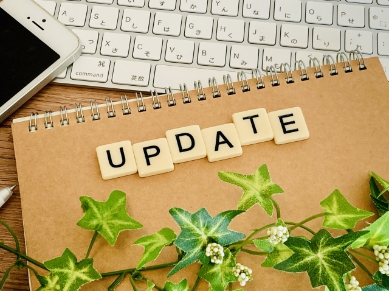

# Yuma Kakuya - ポートフォリオサイト



## 📖 概要

角谷侑磨（Yuma Kakuya）の個人ポートフォリオサイトです。
飲食業界から転身し、IT業界でのキャリアを目指して学習中のエンジニア志望者です。

**公開URL:** [あなたのポートフォリオURL]

## 🎯 プロジェクトの目的

- 学習したWeb開発スキルの実践と証明
- 自己紹介とプロジェクト実績の発信
- 企業や採用担当者への自己アピール
- 継続的な学習記録の公開

## 🛠️ 使用技術

### フロントエンド
- **HTML5** - セマンティックマークアップ、アクセシビリティ対応
- **CSS3** - レスポンシブデザイン、CSS変数、Flexbox、Grid
- **JavaScript (ES6+)** - Fetch API、非同期処理、DOM操作

### バックエンド
- **PHP 7.4+** - フォーム処理、メール送信
- **PHPMailer** - SMTPメール送信ライブラリ

### インフラ・デプロイ
- **AWS API Gateway** - サーバーレスAPIエンドポイント
- **AWS Lambda** - サーバーレス関数実行
- **AWS SES (Simple Email Service)** - メール送信サービス

### 開発ツール
- **Git / GitHub** - バージョン管理、ソースコード管理
- **VSCode / Cursor** - コードエディター

## 📁 プロジェクト構成

```
Portfolio/
├── css/
│   ├── styles.css          # メインスタイルシート
│   └── header.css          # ヘッダー専用スタイル
├── js/
│   └── portfolio.Javascript.script.js  # JavaScriptロジック
├── images/                 # 画像ファイル
│   ├── プロフィール画像海ウクレレ.JPG
│   ├── UPDATE.jpg
│   ├── プログラム画面１.jpg
│   └── ...
├── video/                  # 動画ファイル（オプション）
├── Portfolio1.html         # メインページ (HTMLバージョン)
├── Portfolio1.php          # メインページ (PHPバージョン)
├── project1-details.html   # ウェブサイト制作詳細
├── project2-details.html   # コーディングチャレンジ詳細
├── project3-details.html   # Webアプリ開発詳細
├── sendmail.php            # メール送信処理
└── README.md               # このファイル
```

## 🚀 セットアップ手順

### 前提条件
- PHP 7.4以上
- Composer（PHPパッケージマネージャー）
- AWS アカウント（SES、API Gateway、Lambda使用の場合）

### ローカル環境での実行

1. **リポジトリのクローン**
```bash
git clone https://github.com/YumaKakuya/Portfolio.git
cd Portfolio
```

2. **Composerで依存関係をインストール**
```bash
composer require phpmailer/phpmailer
```

3. **環境変数の設定**

`.env`ファイルを作成（またはサーバー環境変数に設定）:
```env
SMTP_HOST=email-smtp.us-east-1.amazonaws.com
SMTP_USERNAME=your_ses_smtp_username
SMTP_PASSWORD=your_ses_smtp_password
FROM_EMAIL=your-verified@email.com
TO_EMAIL=your-verified@email.com
```

4. **ローカルサーバーの起動**
```bash
# PHPビルトインサーバーを使用
php -S localhost:8000
```

ブラウザで `http://localhost:8000/Portfolio1.html` にアクセス

### AWS SESの設定

1. **AWS SESでメールアドレスを認証**
   - AWS Management Consoleにログイン
   - SESダッシュボードで送信元メールアドレスを検証
   - SMTP認証情報を取得

2. **API Gateway + Lambdaの設定（オプション）**
   - Lambda関数を作成してメール送信ロジックを実装
   - API Gatewayでエンドポイントを作成
   - `portfolio.Javascript.script.js`のエンドポイントURLを更新

## ✨ 主な機能

### 実装済み機能
- ✅ レスポンシブデザイン（モバイル・タブレット・PC対応）
- ✅ スムーズスクロールナビゲーション
- ✅ お問い合わせフォーム（バリデーション付き）
- ✅ AWS API Gateway経由のメール送信
- ✅ GitHub APIを使用したリポジトリ表示
- ✅ SEO対策（メタタグ、OGP設定）
- ✅ アクセシビリティ対応（ARIA属性、キーボード操作）
- ✅ セキュリティ対策（XSS対策、レート制限、入力検証）

### セキュリティ機能
- CSRF保護（セッション管理）
- レート制限（5分以内に3回まで）
- 入力バリデーション（文字数制限、形式チェック）
- XSS対策（HTMLエスケープ処理）
- エラーログ記録

## 🎨 デザインコンセプト

- **清潔感とシンプルさ**: 情報を見やすく、わかりやすく
- **プロフェッショナル**: 落ち着いた色合いとレイアウト
- **ユーザビリティ**: 直感的なナビゲーションと操作性
- **アクセシビリティ**: すべてのユーザーが利用しやすいデザイン

## 📊 パフォーマンス最適化

- 画像の遅延読み込み（lazy loading）
- CSS変数による効率的なスタイル管理
- 最小限のJavaScript使用
- フォントのpreconnect設定

## 🔧 今後の改善予定

- [ ] ダークモード対応
- [ ] 多言語対応（日本語/英語）
- [ ] プロジェクト実績の追加
- [ ] ブログ機能の追加
- [ ] アニメーション効果の強化
- [ ] Lighthouse スコア100点達成

## 📝 学習記録

### 習得したスキル
- HTML/CSSによるレスポンシブWebデザイン
- JavaScriptによる動的なUI実装
- PHPによるサーバーサイド処理
- AWSクラウドサービスの活用
- Git/GitHubによるバージョン管理

### 現在学習中
- Java（オブジェクト指向、例外処理）
- Springフレームワーク
- MySQL（データベース設計、SQL）
- RESTful API設計

## 📞 お問い合わせ

**角谷 侑磨（Yuma Kakuya）**

- GitHub: [YumaKakuya](https://github.com/YumaKakuya)
- Email: [お問い合わせフォームから](Portfolio1.html#contact)

## 📄 ライセンス

© 2025 Yuma Kakuya. All rights reserved.

このプロジェクトは個人ポートフォリオ用に作成されたものです。
コードの参考や学習目的での使用は歓迎しますが、そのまま複製して使用することはご遠慮ください。

---

**Made with ❤️ using HTML, CSS, JavaScript, PHP & AWS**
